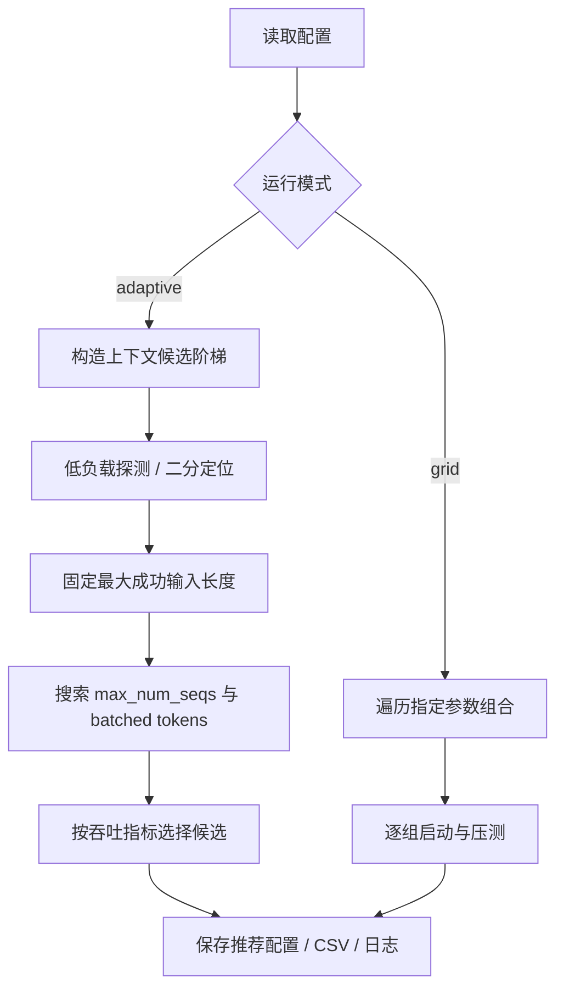

<div align="center">

# ⚡ Ascend Serving Tuner

**Adaptive parameter search for vLLM / vLLM-Ascend inference serving**

自动探测长上下文可运行边界，进一步搜索服务端并发与批处理参数；保留传统网格搜索模式。

<p>
  
  
  
  
  
</p>

[快速开始](#-快速开始) · [自适应模式](#-自适应模式) · [配置示例](#-配置示例) · [结果输出](#-结果输出)

</div>

---

## 🎯 项目简介

服务端参数存在明显耦合：上下文长度影响 KV Cache 占用，并发与批处理 token 上限影响调度、吞吐和延迟。盲目枚举所有组合既耗时，也容易反复触发启动失败或 OOM。

**Ascend Serving Tuner** 提供两种运行模式：

| 模式 | 适用场景 |
|---|---|
| `adaptive` | 先探索最大可运行输入长度，再在该长度上比较并发与批处理配置 |
| `grid` | 对用户明确指定的参数组合做系统性对照实验 |

## ✨ 功能

- 自适应上下文探测：按倍增候选建立搜索区间，再二分定位最大成功档位
- 服务端参数调优：`max-num-seqs`、`max-num-batched-tokens`、TP、显存利用率、Chunked Prefill
- 自动启动服务、健康检查、运行 `vllm bench serve` 并停止本工具启动的进程
- 记录每次实验的配置、启动命令、服务日志、压测日志、JSON 与 CSV
- 输出 `recommendation.json`，记录最大成功输入长度及可解析吞吐指标下的推荐配置

> 当前是实验型 MVP。成功标准是服务健康检查与 benchmark 返回成功；它不等同于经过多轮稳定性验证的生产容量。设备内存探测、OOM 自动恢复、不同芯片参数能力识别及 profiler 集成仍在演进中。

## 🧭 工作流程



## 🚀 快速开始

```bash
git clone https://github.com/FeynmanNddbb/ascend-serving-tuner.git
cd ascend-serving-tuner
cp config.example.json config.json

# 先在当前 shell 初始化对应软件栈
source /usr/local/Ascend/ascend-toolkit/set_env.sh

# 只检查运行模式和候选，不启动服务
python3 tuner.py --config config.json --mode adaptive --dry-run

# 自适应搜索
python3 tuner.py --config config.json --mode adaptive
```

传统网格搜索：

```bash
python3 tuner.py --config config.json --mode grid
```

请先用空闲端口与专用实验机器；不要在生产服务端口上运行。

## 🧠 自适应模式

默认策略：

1. 从 `start_context` 开始构造倍增阶梯，直到 `max_context`。
2. 以低并发基线启动模型并压测，使用二分方式寻找最大成功输入长度档位。
3. 固定已验证的输入长度，遍历指定的 `tune_max_num_seqs` 与 `tune_max_num_batched_tokens`。
4. 对每组运行指定客户端并发，优先按可解析的 output token throughput 选择推荐项；若该指标不可解析，则只输出最大成功上下文，不伪造吞吐最优值。

注意：这里的“最大上下文”是**本次配置和压测条件下最大成功的输入长度档位**，不是硬件理论极限。二分搜索假设成功性大致随上下文长度单调变化；遇到碎片、运行波动或非单调行为时，应使用 grid 复核。输出长度会加到 `max_model_len` 上限中。

## ⚙️ 配置示例

示例以双卡 Ascend、Qwen3.8-27B-W8A8 本地模型为例：

```json
{
  "mode": "adaptive",
  "model": "/workspace/work/data/models/Qwen3.8-27B-w8a8",
  "served_model_name": "qwen3.8",
  "host": "127.0.0.1",
  "port": 8000,
  "visible_devices": "0,1",
  "startup_timeout_sec": 900,
  "shutdown_timeout_sec": 30,

  "auto_tune": {
    "start_context": 4096,
    "max_context": 262144,
    "tensor_parallel_size": 2,
    "probe_max_num_seqs": 1,
    "probe_max_num_batched_tokens": 2048,
    "gpu_memory_utilization": 0.9,
    "enable_chunked_prefill": true,
    "probe_concurrency": 1,
    "tune_max_num_seqs": [1, 2, 4, 8, 16, 32],
    "tune_max_num_batched_tokens": [2048, 4096, 8192, 16384],
    "benchmark_concurrency": [1, 2, 4, 8]
  },

  "benchmark": {
    "output_len": 128,
    "num_prompts": 16,
    "backend": "openai-chat",
    "dataset_name": "random",
    "extra_args": []
  }
}
```

| 参数 | 含义 |
|---|---|
| `start_context` / `max_context` | 输入长度探测下界与上界 |
| `probe_max_num_seqs` | 找上下文边界时采用的服务端序列上限 |
| `probe_max_num_batched_tokens` | 边界探测阶段的批处理 token 上限 |
| `tune_max_num_seqs` | 在最大成功输入长度下尝试的服务端序列上限 |
| `tune_max_num_batched_tokens` | 联合测试的批处理 token 候选 |
| `benchmark_concurrency` | 客户端压测并发；不等于服务端 `max_num_seqs` |

## 📊 结果输出

```text
runs/<timestamp>/
├── summary.csv
├── recommendation.json
├── trial_0001/
│   ├── config.json
│   ├── server_command.txt
│   ├── server.log
│   ├── benchmark.log
│   └── benchmark.json
└── ...
```

- `summary.csv`：每次实验的参数、状态和可识别指标。
- `recommendation.json`：最大成功输入长度及可解析吞吐下的推荐参数。
- 每个 `trial_xxxx`：保留原始日志，便于排查启动失败、请求失败与版本兼容问题。

## ⚠️ 重要边界

- 运行前请在当前 Shell 中 source 对应 CANN 环境；配置里的 `cann_env` 字段目前仅作路径提示，脚本不会自动 source。
- vLLM CLI 和 `vllm bench serve` 参数会随版本变化。请用本机 `vllm serve --help`、`vllm bench serve --help` 核对。
- 本工具只停止自己启动的服务进程，但仍建议使用专用空闲端口。
- 不自动安装驱动/CANN、不下载模型，也不承诺所有硬件后端均已适配。
- 结果是实验测量，不是生产 SLA；建议对推荐配置做多轮、不同请求分布的复测。

## 🗺️ Roadmap

- [x] 网格搜索与逐组实验
- [x] 自适应上下文阶梯探测与二分
- [x] 上下文边界处并发 / batch token 候选搜索
- [x] 日志、CSV 与推荐配置落盘
- [ ] 设备内存自动探测与安全候选生成
- [ ] OOM 分类与自动回退重试
- [ ] TTFT / TPOT 约束与多目标 Pareto 筛选
- [ ] CUDA backend adapter、Ascend Profiler 指标接入
- [ ] HTML 可视化报告

## 📄 License

MIT
