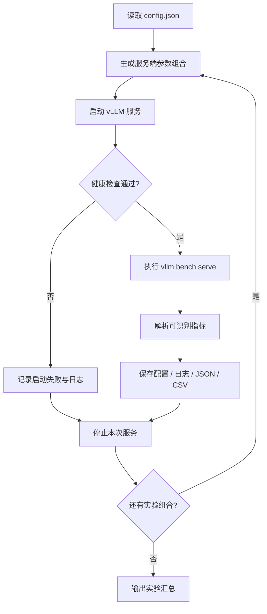

<div align="center">

# ⚡ Ascend Serving Tuner

**面向 vLLM / vLLM-Ascend 的推理服务参数联合搜索工具**

从「手动改参数、重启、压测、记数据」到「配置候选空间、自动跑实验、统一汇总结果」。

<p>
  
  
  
  
</p>

[快速开始](#-快速开始) · [配置说明](#-配置示例) · [工作流程](#-工作流程) · [结果目录](#-结果输出) · [路线图](#-roadmap)

</div>

---

## 🎯 项目简介

在大模型推理部署中，`max-model-len`、`max-num-seqs`、`max-num-batched-tokens`、显存利用率等参数相互影响。单独调整某个参数，往往无法找到适合当前模型、硬件和请求负载的配置。

**Ascend Serving Tuner** 将这些服务端参数组织为候选搜索空间，逐组启动服务并执行 benchmark，保存每次实验的配置、日志和结果，便于比较不同配置下的吞吐与延迟。

> 当前版本定位为实验型 MVP，优先适配固定机器上的 vLLM / vLLM-Ascend 单实例调优。不同 vLLM 版本的 CLI、参数支持及 benchmark 结果格式可能不同，正式实验前请先执行 dry-run 和小规模验证。

## ✨ 当前能力

| 能力 | 说明 |
|---|---|
| 参数组合搜索 | 联合枚举 TP、上下文长度、服务端最大序列数、批处理 token 上限、显存利用率 |
| Chunked Prefill | 可将其作为候选开关参与搜索 |
| 自动服务生命周期 | 每个试验由工具启动服务、等待健康检查、压测后停止该服务 |
| Benchmark | 调用 `vllm bench serve`，支持输入长度、输出长度、请求数和客户端并发配置 |
| 实验留痕 | 保存启动命令、服务日志、压测日志、配置快照及 CSV 汇总 |
| 失败隔离 | 单组启动或压测失败会记录状态，后续组合仍可继续 |

## 🧭 工作流程



## 🚀 快速开始

### 1. 环境准备

请先在目标机器上安装并验证可用的 Python、CANN、PyTorch、torch_npu、vLLM 和 vLLM-Ascend 环境。模型需提前下载到本地。

以常见 CANN 环境为例：

```bash
source /usr/local/Ascend/ascend-toolkit/set_env.sh
npu-smi info
python -c "import torch, torch_npu, vllm; print(torch.__version__, vllm.__version__)"
```

### 2. 获取项目

```bash
git clone https://github.com/FeynmanNddbb/ascend-serving-tuner.git
cd ascend-serving-tuner

cp config.example.json config.json
```

### 3. 修改配置

先把模型路径、设备编号、TP 和候选参数改成当前机器实际情况。首次运行请使用小搜索空间。

### 4. 检查命令，不启动服务

```bash
python3 tuner.py --config config.json --dry-run
```

确认输出的 `vllm serve` 参数与你本机 `vllm serve --help` 一致后，再执行：

```bash
python3 tuner.py --config config.json
```

## ⚙️ 配置示例

下面示例以双卡 Ascend、已本地部署的 Qwen W8A8 模型为例。请按实际设备、模型和软件版本修改。

```json
{
  "model": "/workspace/work/data/models/Qwen3.8-27B-w8a8",
  "served_model_name": "qwen3.8",
  "host": "127.0.0.1",
  "port": 8000,
  "visible_devices": "0,1",
  "cann_env": "/usr/local/Ascend/ascend-toolkit/set_env.sh",
  "startup_timeout_sec": 900,
  "health_timeout_sec": 900,
  "shutdown_timeout_sec": 30,

  "server": {
    "tensor_parallel_size": [2],
    "max_model_len": [4096, 8192, 16384],
    "max_num_seqs": [1, 2, 4, 8, 16, 32],
    "max_num_batched_tokens": [2048, 4096, 8192, 16384],
    "gpu_memory_utilization": [0.85, 0.9],
    "enable_chunked_prefill": [true]
  },

  "benchmark": {
    "input_lengths": [512, 2048, 4096],
    "output_len": 128,
    "num_prompts": 32,
    "max_concurrency": [1, 2, 4, 8, 16],
    "backend": "openai-chat",
    "dataset_name": "random",
    "extra_args": []
  },

  "env": {
    "HCCL_BUFFSIZE": "512",
    "PYTORCH_NPU_ALLOC_CONF": "expandable_segments:True"
  }
}
```

### 参数怎么理解？

| 配置项 | 作用 | 调优建议 |
|---|---|---|
| `tensor_parallel_size` | 张量并行卡数 | 必须与可见设备及模型部署方式匹配 |
| `max_model_len` | 单请求最大序列长度 | 从目标上下文长度附近开始，逐步增加 |
| `max_num_seqs` | 服务端调度的最大序列数 | 逐档增加，观察显存、吞吐和尾延迟 |
| `max_num_batched_tokens` | 单次调度批处理 token 上限 | 与 Prefill 负载、上下文长度联合调节 |
| `gpu_memory_utilization` | vLLM 可用设备内存比例 | 逐步增加，留意启动失败和 OOM |
| `enable_chunked_prefill` | 是否启用分块 Prefill | 结合长输入、混合请求负载对比 |
| `max_concurrency` | Benchmark 客户端并发 | 是压测负载，不等于服务端 `max_num_seqs` |

### 搜索规模提醒

候选组合数约为各服务端参数候选数量的乘积；再乘以输入长度与客户端并发档位，实验数会迅速增加。

建议先用以下小规模配置验证流程：

```json
{
  "server": {
    "tensor_parallel_size": [2],
    "max_model_len": [4096],
    "max_num_seqs": [1, 4],
    "max_num_batched_tokens": [2048, 4096],
    "gpu_memory_utilization": [0.85],
    "enable_chunked_prefill": [true]
  },
  "benchmark": {
    "input_lengths": [512],
    "output_len": 64,
    "num_prompts": 8,
    "max_concurrency": [1, 2],
    "backend": "openai-chat",
    "dataset_name": "random",
    "extra_args": []
  }
}
```

## 📊 结果输出

每次运行会创建独立时间戳目录：

```text
runs/
└── 20261003_193000/
    ├── summary.csv
    ├── trial_0001/
    │   ├── config.json
    │   ├── server_command.txt
    │   ├── server.log
    │   ├── benchmark.log
    │   └── benchmark.json
    └── trial_0002/
        └── ...
```

- **summary.csv**：每组参数及可识别的吞吐、延迟、成功/失败统计。
- **server.log**：模型加载、服务启动及运行日志。
- **benchmark.log**：压测输出，便于排查客户端参数或请求错误。
- **benchmark.json**：当前 benchmark 命令生成的原始结果（若该版本支持保存）。

不同版本的结果 JSON 字段可能不同。程序只提取已识别字段；请保留原始日志并核对指标定义，不要直接跨版本比较未经校准的数据。

## ⚠️ 使用边界与安全提示

1. **请勿在已有生产服务端口上直接运行。** 工具会启动自己的服务进程，并在每次实验后停止该进程；建议使用空闲端口和专用实验机器。
2. 当前脚本通过环境变量传递设备可见性和 `env` 字段。运行前请在当前 Shell 中完成 CANN 环境初始化（例如执行上面的 `source` 命令）。
3. 配置中的 `cann_env` 目前用于提示环境路径，不代表脚本会自动 source 它。
4. `vllm bench serve` 参数在不同版本间可能变化。请运行 `vllm bench serve --help` 核对；必要时调整 `benchmark.extra_args` 或脚本。
5. 当前实现不负责安装驱动/CANN、不下载模型、不自动判断所有后端参数是否受支持，也不保证所有候选配置都能成功启动。
6. 首次请小规模运行，确认进程退出、端口释放和日志记录行为符合预期。

## 🗺️ Roadmap

- [x] 参数网格生成与逐组实验
- [x] 服务健康检查与日志归档
- [x] CSV 汇总与失败状态记录
- [ ] 结果指标 schema 适配与版本探测
- [ ] Pareto 前沿筛选（吞吐 / TTFT / TPOT / 显存）
- [ ] CUDA backend adapter
- [ ] Ascend 参数能力检测与 profiler 指标接入
- [ ] HTML 可视化报告

## 🤝 Contributing

欢迎提交 Issue 或 Pull Request：参数适配、benchmark 兼容、指标解析、可视化和新硬件 backend 都是有价值的贡献方向。

## 📄 License

MIT
